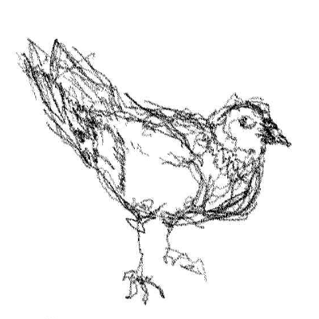

<p align="center">
  
</p>

# cap-y (Agentic Robot Manipulation)


[Get Started](#get-started) · [What's Inside](#whats-inside) · [Wheels](#pre-built-wheels) · [Containers](#container-family) · [vs CaP-X](#vs-cap-x-upstream)

[Docs](#docs) · [LinkedIn](https://linkedin.com/in/sevapru) · [wheels.sobaka.dev](https://wheels.sobaka.dev)

**CUDA-optimized Docker runtime for robot control on NVIDIA Jetson Thor.**

Dedicated environemnt for Agentic humanoid robot operation designed to provide best performance and acceleration available.

Fork of [CaP-X](https://github.com/capgym/cap-x). Everything that can run on GPU -- runs on GPU. Pull the container, plug in your robot, go.
by [sobaka.dev](https://sobaka.dev) 🐕


## Get Started

### One-line Install

```bash
curl -sSL https://raw.githubusercontent.com/sevapru/cap-y/main/scripts/install.sh | bash
```

### Pull & Run

```bash
docker pull ghcr.io/sevapru/cap-y:latest
docker tag ghcr.io/sevapru/cap-y:latest cap-y:latest
docker run -it --rm --runtime nvidia --entrypoint bash -v .:/workspace cap-y
```

### Build from Source (like... 3 hours?)

> ⚡ Tested on **Jetson AGX Thor** (sm_110, CUDA 13.0, 128 GB unified memory)

```bash
git clone --recurse-submodules https://github.com/sevapru/cap-y && cd cap-y/docker

# Auto-detect GPU and build (nvidia-smi detects sm_110 on Thor)
./build.sh # Or specify GPU architecture manually with --arch 11.0 or --arch 8.9 (for RTX 4080)
```
Build takes ~2-3 hours first time (OpenCV CUDA + Open3D CUDA + JAX from source). Subsequent builds use ccache (~10 min).

Build log always goes to `/tmp/cap-y-build.log`. Check for errors:
```bash
grep -i "error:" /tmp/cap-y-build.log | grep -v warning
```

### Build with Docker Compose

```bash
cd cap-y/docker
docker compose -f docker-compose.capx.yml up -d --build
```

Override build args via environment:
```bash
CUDA_ARCH=8.9 docker compose -f docker-compose.capx.yml build    # RTX 4080
```

### Start Perception Servers

```bash
cd cap-y/docker
docker compose -f docker-compose.capx.yml up -d                         # default: SAM3 + GraspNet + PyRoKi
CAPX_PROFILE=full docker compose -f docker-compose.capx.yml up -d       # + OWL-ViT + SAM2
CAPX_PROFILE=minimal docker compose -f docker-compose.capx.yml up -d    # PyRoKi only (IK go brrrr 🏎️)
```

Interactive shell:
```bash
docker run -it --rm --runtime nvidia --entrypoint bash -v .:/workspace cap-y
```

Or add to `~/.bashrc` for one-word access:
```bash
alias cap-y='docker run -it --rm --runtime nvidia --entrypoint bash -v .:/workspace cap-y'
# then just: cap-y
```

### Verify Everything Works

```bash
cd cap-y/docker
docker compose -f docker-compose.capx.yml --profile test run cap-y-test # Expected: 8/8
```


## What's Inside

| Module | Version | CUDA | Notes | On PyPI for aarch64? |
|--------|---------|------|-------|:---:|
| OpenCV | 4.13 | cuDNN 9.12, cuBLAS, FAST_MATH | GStreamer, NEON FP16/BF16 🏃 | ❌ no CUDA wheel |
| Open3D | 0.19+ | CUDA tensors, PyTorch ops | RealSense D455, Open3D-ML, GUI | ❌ no wheel at all |
| JAX | 0.9.2 | SM 110 native kernels | Built from source, no PTX JIT  | ❌ no SM 110 kernels |
| CuRobo | 0.7 | 5 CUDA extensions | Collision-free trajectories | ❌ needs CUDA + torch |
| ContactGraspNet | - | PointNet2 CUDA ops | 6-DOF grasps from depth | ❌ needs CUDA build |
| PyTorch | 2.11 cu130 | FlashAttention-4, sm_110 | aarch64 native | ✅ |
| MuJoCo | 3.6 | EGL headless | LIBERO evaluation | ✅ |
| ROS 2 | Jazzy | - | rclpy + msg types  | ✅ apt |

**5 out of 8 modules have no pre-built aarch64 CUDA packages anywhere.** We build them from source with full GPU acceleration for Jetson Thor.


If you'd actually compare it with [jetson-containers](https://github.com/dusty-nv/jetson-containers/tree/master?tab=readme-ov-file)  - you'll understand how great this set is for 02.04.2026. 
There is, mainly, no on-time cu130 support for containers and, as I would tell you: not enough developers who can provide this builds. 


## Pre-built Wheels

Index: [wheels.sobaka.dev](https://wheels.sobaka.dev)

These don't exist on PyPI for Jetson Thor. We built them so you don't have to (you're welcome 🎁):

```bash
uv pip install --extra-index-url https://wheels.sobaka.dev/simple/ \
  opencv-python-headless open3d jaxlib jax-cuda13-plugin
```


| Package     | What you'd spend building it | What you spend with us |
| ----------- | ---------------------------- | ---------------------- |
| OpenCV CUDA | ~1 hour                      | `pip install` & ☕     |
| Open3D CUDA | ~40 min                      | `pip install` & ☕     |
| JAX SM 110  | ~2 hours                     | `pip install` & ☕     |
 


## Container Family

Split by license -- pick what you need:


| Container      | Adds                                                     | License        | Vibe                                    |
| -------------- | -------------------------------------------------------- | -------------- | --------------------------------------- |
| `cap-y`        | OpenCV, Open3D, PyTorch, JAX, CuRobo, perception servers | Mixed          | "I see things and grab them" 👁️🤖      |
| `cap-y-open`   | + ROS 2, Nav2, MoveIt 2, Drake, LiveKit                  | Apache/BSD/MIT | "I plan and navigate, commercially" 🗺️ |
| `cap-y-nvidia` | + Isaac ROS cuMotion, cuVSLAM, NITROS                    | NVIDIA license | "I have enterprise friends" 🏢          |


```bash
docker build -f docker/Dockerfile.open -t cap-y-open:latest ..
docker build -f docker/Dockerfile.nvidia -t cap-y-nvidia:latest ..
```


## Ports


| Port | Service                | When      |
| ---- | ---------------------- | --------- |
| 8110 | LLM proxy (OpenRouter) | always    |
| 8113 | SAM2                   | `full`    |
| 8114 | SAM3                   | `default` |
| 8115 | ContactGraspNet        | `default` |
| 8116 | PyRoKi IK              | `default` |
| 8117 | OWL-ViT                | `full`    |
| 8118 | CuRobo                 | custom    |


## vs CaP-X (upstream)


|                             | CaP-X                        | cap-y                               |
| --------------------------- | ---------------------------- | ----------------------------------- |
| Install                     | `uv sync` + CUDA (maybe)     | `docker pull` ☁️                    |
| OpenCV                      | CPU                          | ✅ CUDA (cuDNN, cuBLAS, FAST_MATH)     |
| Open3D                      | ❌ no aarch64 wheel           | ✅ CUDA + PyTorch ops + RealSense    |
| JAX                         | CPU (SM 110 kernels missing) | ✅ SM 110 native (built from source) |
| Time to first robot command | hours                        | minutes                             |


## Docs


| File                                                                   | What                                  |
| ---------------------------------------------------------------------- | ------------------------------------- |
| [docker/OPTIMISATIONS.md](docker/OPTIMISATIONS.md)                     | Optimisations relevant to Jetson Thor |
| [.claude/CLAUDE.md](.claude/CLAUDE.md)                                 | Agent/dev docs                        |
| [scripts/test_cuda_acceleration.py](scripts/test_cuda_acceleration.py) | CUDA test suite                       |


For upstream CaP-X docs (environments, APIs, RL training): [github.com/capgym/cap-x](https://github.com/capgym/cap-x)


## Citation

If cap-y saved you from compiling OpenCV at 3 AM, cite the original work that made it possible:

```bibtex
@article{fu2025capx,
  title     = {{CaP-X}: A Framework for Benchmarking and Improving Coding Agents for Robot Manipulation},
  author    = {Fu, Max and Yu, Justin and El-Refai, Karim and Kou, Ethan and Xue, Haoru and others},
  journal   = {arXiv preprint arXiv:2603.22435},
  year      = {2025}
}
```

## License

Upstream CaP-X: MIT. Docker additions: MIT. Individual packages: see container family table.

Hope you have a good day, Seva

Built with 🐾 by [sobaka.dev](https://sobaka.dev)