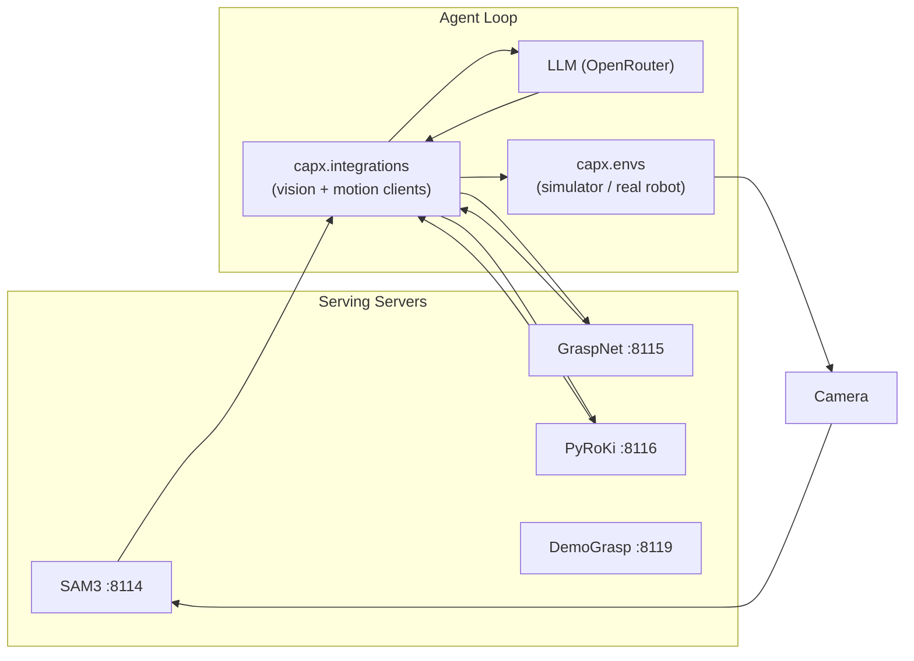
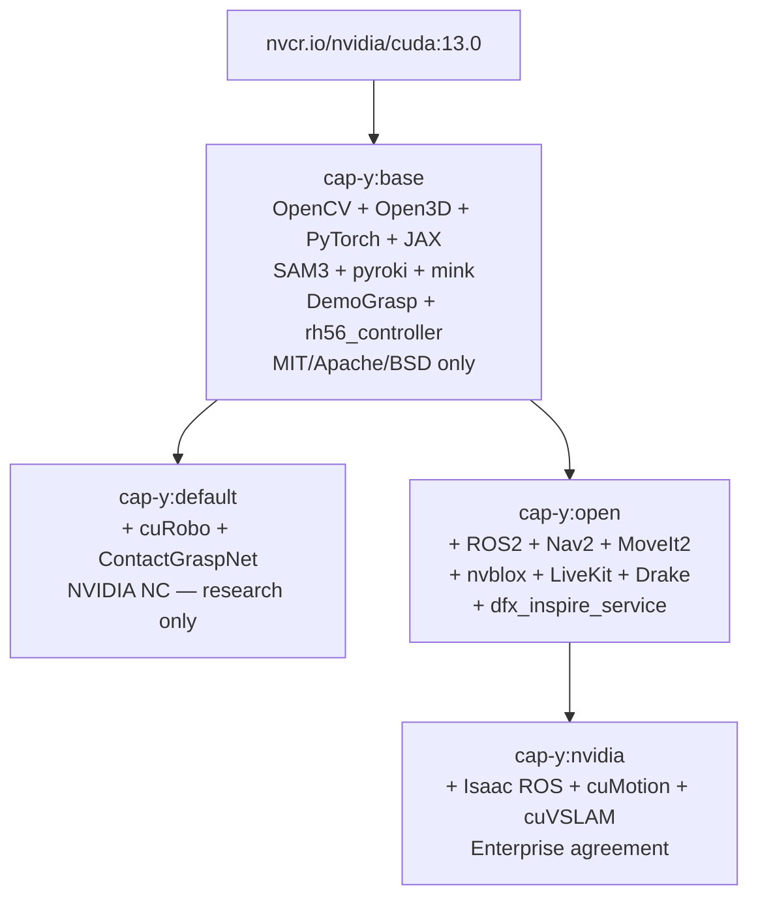

<p align="center">
  
</p>

# cap-y (Agentic Robot Manipulation)


[Get Started](#get-started) · [What's Inside](#whats-inside) · [Wheels](#pre-built-wheels) · [Containers](#container-family) · [vs CaP-X](#vs-cap-x-upstream)

[Docs](#docs) · [LinkedIn](https://linkedin.com/in/sevapru) · [wheels.sobaka.dev](https://wheels.sobaka.dev)

**CUDA-optimized Docker runtime for robot control on NVIDIA Jetson Thor.** by [sobaka.dev](https://sobaka.dev) 🐕

Dedicated environemnt for Agentic humanoid robot operation designed to provide best performance and acceleration available.

Fork of [CaP-X](https://github.com/capgym/cap-x). Everything that can run on GPU -- runs on GPU. Pull the container, plug in your robot, go.

Jetson Thor is **Blackwell SBSA** architecture running JetPack 7.0 (Ubuntu 24.04, Kernel 6.8, CUDA 13.0). Generic aarch64 CUDA wheels from PyPI do not work here — PyTorch wheels at `download.pytorch.org` (cu128/cu129) target server ARM (GH200/GB200), not Jetson. This container ships the correct binaries built for SM 110.

### One-line Install

```bash
curl -sSL https://raw.githubusercontent.com/sevapru/cap-y/main/scripts/install.sh | bash
```

## What's Inside

| Module | Version | CUDA | Notes | On PyPI for aarch64? | cap-y |
|--------|---------|------|-------|:---:|:---:|
| OpenCV | 4.13 | cuDNN 9.12, cuBLAS, FAST_MATH | GStreamer, NEON FP16/BF16 🏃 | no CUDA wheel | ✅ |
| Open3D | 0.19+ | CUDA tensors, PyTorch ops | RealSense D455, Open3D-ML, GUI | no wheel at all | ✅ |
| JAX | 0.9.2 | SM 110 native kernels | from source, no PTX JIT  | no SM 110 kernels | ✅ |
| CuRobo | 0.7 | 5 CUDA extensions | Collision-free trajectories | no CUDA + torch | ✅ |
| ContactGraspNet | - | PointNet2 CUDA ops | 6-DOF grasps from depth | no CUDA build | ✅ |
| PyTorch | 2.11 cu130 | FlashAttention-4, sm_110 | aarch64 native | ✅ | ✅ |
| MuJoCo | 3.6 | EGL headless | LIBERO evaluation | ✅ | ✅ |
| ROS 2 | Jazzy | - | rclpy + msg types  | ✅ | ✅ |

**5 out of 8 modules have no pre-built aarch64 CUDA packages in different distros.** All verified with `test_container_base.py` (9/9).

Three no non-obvious build details worth knowing: 
1. the OpenCV CUDA build installs a dummy `opencv_python_headless` dist-info record so pip never overwrites it with a CPU wheel from PyPI (got flashbacks of compiling opencv for c++ bindings couple of years about for real-time jaw tracking and tractor control on edge-compute. good old fun:) 

2. FP16 half-cast patches from jetson-containers are applied to the DNN module to avoid CUDA kernel assertion failures on Tegra. JAX ships SM 110 pre-compiled kernels; if you hit `cudaErrorNoKernelImageForDevice` on a different arch, set `XLA_FLAGS="--xla_gpu_autotune_level=0"` to force PTX JIT fallback. Well, Jetson Thor. Also, why do you need FP16. What else? FW in FP32??? You ether on compute-efficiency diet or go build your plots, buddy (no offence) 

If you'd actually compare it with [jetson-containers](https://github.com/dusty-nv/jetson-containers/tree/master?tab=readme-ov-file)  -  There is, mainly, late on-time (cu130) support for containers and, as I would tell you: not enough developers who can provide this builds (so someone should do it). You'll understand how great this set is for 03.04.2026 or later if you'd need to recompile some cores and use anything as a cap-base for your mechanical or hydraulic friendo.


## Architecture

### Project Structure

```
cap-y/
├── capx/
│   ├── envs/           # Gymnasium-compatible environments
│   │   ├── simulators/ # robosuite, LIBERO, real Franka, R1Pro registrations
│   │   ├── tasks/      # Task implementations (cube stack, nut assembly, LIBERO, …)
│   │   ├── adapters/   # robosuite_wrapper, libero_wrapper
│   │   └── launch.py   # Entrypoint: uv run capx/envs/launch.py --config …
│   ├── integrations/   # Robot + perception API clients
│   │   ├── franka/     # Franka control stacks (privileged, reduced, skill-lib…)
│   │   ├── motion/     # pyroki.py, curobo.py — HTTP clients to serving servers
│   │   └── vision/     # sam2.py, sam3.py, owlvit.py, graspnet.py
│   ├── serving/        # FastAPI servers (SAM3, PyRoKi, GraspNet, DemoGrasp, …)
│   ├── skills/         # Skill library (extraction, storage, Claude prompts)
│   ├── llm/            # LLM client wrapper
│   └── web/            # FastAPI web UI backend
├── docker/             # Dockerfile.base, Dockerfile, Dockerfile.open, Dockerfile.nvidia, Dockerfile.dev
├── env_configs/        # 170 YAML experiment profiles (cube_stack/, libero/, r1pro/, …)
├── scripts/            # Container tests, install, regression tests
└── tests/              # pytest suite (Tier 1–4: imports, server health, API, simulation)
```

### Agent Loop Data Flow



> **CaP-Agent0** is not a Python package — it is an experiment config label used in `env_configs/libero/franka_libero_cap_agent0.yaml`. The CaP-X paper's agent variants (Agent-0 = code-as-policies baseline, Agent-1 = + skill library, etc.) correspond to YAML config choices, not separate packages.

## Get Started

The fastest path is via Docker Compose — it handles GPU passthrough, volumes, and environment automatically. Use `capx-base` for interactive exploration without starting any servers:

```bash
# Drop into bash with GPU access and source mounted — no servers started
docker compose -f docker/docker-compose.capx.yml run --rm capx-base

# Or start servers first, then get a shell with setup (editable install runs on entry)
docker compose -f docker/docker-compose.capx.yml run --rm capx-serving bash
```

The entrypoint runs an editable install of the package on every start so code changes in `/workspace` are picked up immediately without a rebuild. Pass any command to override the default server launch.

### Pull & Run

All four images are available from GHCR as tags on `ghcr.io/sevapru/cap-y`:

| Tag | Pull command | Commercial |
|-----|-------------|-----------|
| `cap-y:base` | `docker pull ghcr.io/sevapru/cap-y:base` | Yes (SAM conditions) |
| `cap-y:default` | `docker pull ghcr.io/sevapru/cap-y:default` | No (NVIDIA NC) |
| `cap-y:open` | `docker pull ghcr.io/sevapru/cap-y:open` | Yes (SAM conditions) |
| `cap-y:nvidia` | `docker pull ghcr.io/sevapru/cap-y:nvidia` | Enterprise agreement |

```bash
# base — MIT/Apache clean: SAM3 + pyroki + mink + DemoGrasp + rh56_controller
docker pull ghcr.io/sevapru/cap-y:base
docker run -it --rm --runtime nvidia --entrypoint bash -v .:/workspace ghcr.io/sevapru/cap-y:base

# default — + cuRobo + ContactGraspNet (NVIDIA NC, research only)
docker pull ghcr.io/sevapru/cap-y:default
docker run -it --rm --runtime nvidia --entrypoint bash -v .:/workspace ghcr.io/sevapru/cap-y:default

# open — base + ROS 2 Jazzy, Nav2, MoveIt 2, nvblox, LiveKit, Inspire hand
docker pull ghcr.io/sevapru/cap-y:open
docker run -it --rm --runtime nvidia --entrypoint bash -v .:/workspace ghcr.io/sevapru/cap-y:open

# nvidia — open + Isaac ROS cuMotion, cuVSLAM, ScheduleStream
docker pull ghcr.io/sevapru/cap-y:nvidia
docker run -it --rm --runtime nvidia --entrypoint bash -v .:/workspace ghcr.io/sevapru/cap-y:nvidia
```

Verify after pull (runs base + layer-specific checks):
```bash
cd cap-y/docker

docker compose -f docker-compose.capx.yml --profile test run --rm capx-test
# --profile test-open run --rm capx-test-open
# --profile test-nvidia run --rm capx-test-nvidia
```

### Build from Source (like... 3 hours?)

> ⚡ Tested on **Jetson AGX Thor** (sm_110, CUDA 13.0, 128 GB unified memory)

```bash
git clone --recurse-submodules https://github.com/sevapru/cap-y && cd cap-y/docker

./build.sh # Or specify GPU architecture: --arch <gpu_version> ( --arch 8.9 for RTX 4080, default: 11.0)
```
Subsequent builds use ccache (~10 min)
Build takes ~2-3 hours first time (OpenCV CUDA + Open3D CUDA + JAX from source)

`build.sh` calls `nvidia-smi --query-gpu=compute_cap` to auto-detect your GPU and passes the result as `CUDA_ARCH_BIN`. On Jetson Thor this returns `11.0`. If detection fails (no GPU on the build machine, CI environment), pass `--arch` explicitly — the script exits with a clear error rather than silently defaulting. Use `--all` to build the full 4-image chain: `cap-y:base` → `cap-y:default` (parallel) and `cap-y:base` → `cap-y:open` → `cap-y:nvidia`.

Check log for errors: `/tmp/cap-y-build.log`
```bash
grep -i "error:" /tmp/cap-y-build.log | grep -v warning
```

### Build with Docker Compose

```bash
cd cap-y/docker
docker compose -f docker-compose.capx.yml up -d --build
```

Build args:

| Arg | Effect | Example |
|-----|--------|---------|
| `CUDA_ARCH_BIN` | GPU compute capability | `--build-arg CUDA_ARCH_BIN=8.9` (RTX 4080) |
| `WITH_LIBERO=1` | Add LIBERO evaluation venv (robosuite/MuJoCo) | `--build-arg WITH_LIBERO=1` |
| `CLEAN_CACHES=1` | Remove bazel/uv/ccache for smaller image | `--build-arg CLEAN_CACHES=1` |
| `--all` (build.sh) | Build all 4 images: base → default + base → open → nvidia | `./build.sh --all` |

```bash
# Publishing: full image with LIBERO + clean caches
docker compose -f docker-compose.capx.yml build \
  --build-arg WITH_LIBERO=1 --build-arg CLEAN_CACHES=1
```

### Start Perception Servers

```bash
cd cap-y/docker
# cap-y:base (commercial-safe: SAM3 + DemoGrasp + rh56 + PyRoKi)
docker compose -f docker-compose.capx.yml up -d cap-y-base

# cap-y:default (research: SAM3 + ContactGraspNet + PyRoKi — NC license)
docker compose -f docker-compose.capx.yml up -d cap-y-default

# cap-y:open (commercial-safe + ROS2 stack)
CAPX_PROFILE=full docker compose -f docker-compose.capx.yml --profile open up -d

CAPX_PROFILE=minimal docker compose -f docker-compose.capx.yml up -d    # PyRoKi only (IK go brrrr 🏎️)
```

Interactive shell:
```bash
docker run -it --rm --runtime nvidia --entrypoint bash -v .:/workspace cap-y
```

Or add to `~/.bashrc` for one-word access:
```bash
alias cap-y='docker run -it --rm --runtime nvidia --entrypoint bash -v .:/workspace cap-y'
# then just: cap-y
```

### Verify Everything Works

```bash
cd cap-y/docker
docker compose -f docker-compose.capx.yml --profile test run --rm capx-test  # Expected: 9/9
```

## Pre-built Wheels

Index: [wheels.sobaka.dev](https://wheels.sobaka.dev)

Pre-built for **Jetson Thor aarch64, Python 3.12, CUDA 13.0, SM 110**. None of these exist on PyPI 🎁

```bash
uv pip install --extra-index-url https://wheels.sobaka.dev/simple/ \
  jaxlib jax-cuda13-plugin jax-cuda13-pjrt
```

| Package | Build time saved | What's special |
|---------|-----------------|----------------|
| jaxlib 0.9.2 | ~2 hours | SM 110 native kernels, no PTX JIT |
| jax-cuda13-plugin | (same build) | SM 110 pre-compiled XLA |
| jax-cuda13-pjrt | (same build) | CUDA 13 runtime |

OpenCV CUDA and Open3D CUDA are available via the `cap-y` container (cmake/source builds don't produce portable wheels).
 


## Container Family

Four tags, one image (`ghcr.io/sevapru/cap-y`). Build chain: base → default, base → open → nvidia.



| Tag | Adds | License ceiling | Commercial |
| --- | ---- | --------------- | ---------- |
| `cap-y:base` | OpenCV CUDA, Open3D, PyTorch, JAX, SAM3, pyroki, mink, DemoGrasp, rh56_controller | Meta SAM License | Yes (SAM conditions) |
| `cap-y:default` | + cuRobo, ContactGraspNet (FROM base) | NVIDIA NC (cuRobo) | No |
| `cap-y:open` | + ROS 2, Nav2, MoveIt 2, nvblox, LiveKit, Drake, Inspire hand (FROM base) | Meta SAM License | Yes (SAM conditions) |
| `cap-y:nvidia` | + Isaac ROS cuMotion, cuVSLAM, ScheduleStream (FROM open) | NVIDIA Source Code | Enterprise agreement |

<details>
<summary><b>cap-y:open</b> — verified components (also in cap-y:base)</summary>

| Component | Version / Count | Status | Notes |
|-----------|----------------|--------|-------|
| ROS 2 Jazzy | `ros-base` | Verified | `rclpy` import, `ros2` CLI |
| Nav2 | 34 packages | Verified | Full navigation stack via `nav2-bringup` |
| MoveIt 2 | 27 packages | Verified | Motion planning, `moveit_core`, `moveit_ros_planning` |
| ros2_control | 6 packages | Verified | `controller_manager` + controllers |
| CycloneDDS | `rmw_cyclonedds_cpp` | Verified | `RMW_IMPLEMENTATION` set, package installed |
| nvblox | C++ core lib | Verified | `libnvblox` + headers at `/usr/local/` (Apache 2.0, NOT Isaac ROS wrapper) |
| LiveKit | SDK + agents | Verified | `livekit`, `livekit-agents`, `livekit-plugins-silero` |
| Drake / GCS | — | Skipped on aarch64 | No aarch64 wheel; available on x86_64 |
| Bimanual readiness | MoveIt dual-arm | Verified | `moveit_core` + dual-arm URDF loading via `robot_descriptions` |

</details>

<details>
<summary><b>cap-y:nvidia</b> — verified components</summary>

| Component | Status | Notes |
|-----------|--------|-------|
| Isaac ROS apt repo | Configured | `release-4.3` for Noble at `isaac.download.nvidia.com` |
| Isaac ROS common + NITROS | Pending | Jazzy packages not yet in NVIDIA repo (graceful skip) |
| cuMotion | Source cloned | Colcon build skipped — needs Isaac ROS NITROS deps |
| cuVSLAM | Built | Source cloned + `colcon build` installed |
| nvblox Isaac ROS wrapper | Built | Source cloned + `colcon build` installed |
| cuTAMP | Pending | Not on PyPI; install from NVIDIA NGC when available |
| ScheduleStream | Pending | NVlabs/ScheduleStream cloned; editable install needs cuRobo runtime |
| Isaac ROS workspace | 3 src / 5 built | `/opt/isaac_ros_ws/` |

**Bimanual stack** (from [Vorndamme et al.](https://schedulestream.github.io/) insights):

```
nvblox (scene SDF)  →  cuMotion (per-arm MoveIt)  →  ScheduleStream (bimanual scheduling)
     ↓                                                        ↓
 obstacle avoidance                                  dual-arm coordination
                                                     (cooperative task-space)
```

cuMotion plans each arm independently through MoveIt 2. ScheduleStream adds the missing bimanual coordination layer — temporal scheduling with GPU-accelerated samplers that produces parallel dual-arm motion instead of sequential single-arm plans. CycloneDDS provides the DDS transport for joint velocity commands at 1 kHz to the G1's native impedance controller.

</details>

```bash
# Build all 4 images in one shot
cd cap-y/docker && ./build.sh --all

# Or build individually
docker build -f docker/Dockerfile.base -t cap-y:base ..
docker build -f docker/Dockerfile      --build-arg BASE_IMAGE=cap-y:base -t cap-y:default ..
docker build -f docker/Dockerfile.open --build-arg BASE_IMAGE=cap-y:base -t cap-y:open ..
docker build -f docker/Dockerfile.nvidia --build-arg BASE_IMAGE=cap-y:open -t cap-y:nvidia ..
```

`cap-y:base` ships 8 CUDA frameworks in ~21 GB — smaller than NVIDIA's own `vllm:latest-jetson-thor` at 35.6 GB which serves a single purpose on an older CUDA/Torch stack. `Dockerfile.nvidia` uses `|| echo "INFO: ..."` fallbacks throughout so the image builds cleanly even without NVIDIA NGC access or an Enterprise account; components that can't be fetched are gracefully skipped. Isaac ROS Jazzy packages were not yet available in NVIDIA's apt repo as of April 2026 — cuMotion and NITROS are cloned from GitHub and built via colcon instead.


## Ports


| Port | Service                | Profile(s)             |
| ---- | ---------------------- | ---------------------- |
| 8100 | Gateway (reverse proxy)| `open`, `default`, `full`, `nvidia` |
| 8110 | LLM proxy (OpenRouter) | `open`, `default`, `full`, `nvidia` |
| 8113 | SAM2                   | `full`                 |
| 8114 | SAM3                   | all except `minimal`   |
| 8115 | ContactGraspNet        | `default`, `full`      |
| 8116 | PyRoKi IK              | all profiles           |
| 8117 | CuRobo                 | `default`, `full`      |
| 8118 | OWL-ViT                | `full`                 |
| 8119 | DemoGrasp              | `open`, `full`, `nvidia` |
| 8120 | GraspAnalytic (rh56)   | `open`, `full`, `nvidia` |

`CAPX_PROFILE=minimal` starts only PyRoKi (no gateway; the gateway falls back to `open` profile if `minimal` is set via env). Use `minimal` for pure IK workloads.

Port assignments in `docker-compose.capx.yml` are straightforward to remap — adjust the `ports:` section to fit your setup. The launcher allocates servers to GPUs via greedy VRAM bin-packing at startup. On Tegra, `nvidia-smi` returns `[N/A]` for memory queries (unified memory architecture), so the launcher falls back to `torch.cuda.mem_get_info()` for accurate free-memory reporting. Set `CAPX_PROFILE` to switch server sets without any rebuild.


## Tegra / Jetson Gotchas

Runtime quirks discovered through extensive testing on Jetson Thor:

- **`nvidia-smi` returns `[N/A]` for GPU memory** — Jetson uses unified memory; use `tegrastats` or `torch.cuda.mem_get_info()` instead.
- **Git safe directory** — run `git config --global --add safe.directory '*'` when running as root inside a container over host-mounted volumes; all submodules are affected.
- **JAX on SM 110** — set `XLA_FLAGS="--xla_gpu_autotune_level=0"` if you hit `cudaErrorNoKernelImageForDevice`; forces PTX JIT instead of missing pre-compiled kernels.
- **`NVIDIA_VISIBLE_DEVICES=all` + `NVIDIA_DRIVER_CAPABILITIES=all`** — both env vars are required for nvidia-container-toolkit to expose the GPU on Tegra; `runtime: nvidia` alone is not sufficient.
- **`robot_descriptions` clones URDFs on first import** — performs a live `git clone` at runtime. Ensure network access on cold start or pre-warm the cache.
- **cuBLAS `< 13.2` TMEM warning** — cosmetic double-free warning on Blackwell with CUDA 13.0; does not affect correctness.


## vs CaP-X (upstream)


|                             | CaP-X                        | cap-y                               |
| --------------------------- | ---------------------------- | ----------------------------------- |
| Install                     | `uv sync` + CUDA (maybe)     | `docker pull` ☁️                    |
| OpenCV                      | CPU                          | ✅ CUDA (cuDNN, cuBLAS, FAST_MATH)     |
| Open3D                      | ❌ no aarch64 wheel           | ✅ CUDA + PyTorch ops + RealSense    |
| JAX                         | CPU (SM 110 kernels missing) | ✅ SM 110 native (built from source) |
| Time to first robot command | hours                        | minutes                             |

This is a generational difference. Existing Jetson containers — including NVIDIA's own vLLM image — were built on older CUDA and PyTorch stacks before CUDA 13.0 / SM 110 toolchains stabilised. cap-y targets CUDA 13.0 / Torch 2.11 / SM 110 natively and is the first public container set to do so for the full robotics perception stack. 5 of the 8 modules have zero pre-built aarch64 CUDA packages on PyPI or any other public index as of April 2026.

`cap-y-open` extends the base with a commercially-clean robotics stack (ROS 2 Jazzy, Nav2, MoveIt 2, CycloneDDS, nvblox C++ core, LiveKit — all Apache 2.0 / BSD). `cap-y-nvidia` adds the GPU-accelerated NVIDIA stack (cuMotion, cuVSLAM, ScheduleStream) for the bimanual G1 pipeline, requiring an NVIDIA Source Code License Agreement for production use.


## Docs


| File                                                                   | What                                  |
| ---------------------------------------------------------------------- | ------------------------------------- |
| [docker/OPTIMISATIONS.md](docker/OPTIMISATIONS.md)                     | Optimisations relevant to Jetson Thor |
| [ROADMAP.md](ROADMAP.md)                                               | Delegatable tasks for contributors / subagents |
| [NOTICE](NOTICE)                                                       | Full component license inventory      |
| [.claude/CLAUDE.md](.claude/CLAUDE.md)                                 | Agent/dev docs                        |
| [scripts/test_cuda_acceleration.py](scripts/test_cuda_acceleration.py) | CUDA test suite                       |


For upstream CaP-X docs (environments, APIs, RL training): [github.com/capgym/cap-x](https://github.com/capgym/cap-x)


## Citation

If cap-y saved you from compiling OpenCV at 3 AM, cite the original work that made it possible:

```bibtex
@article{fu2025capx,
  title     = {{CaP-X}: A Framework for Benchmarking and Improving Coding Agents for Robot Manipulation},
  author    = {Fu, Max and Yu, Justin and El-Refai, Karim and Kou, Ethan and Xue, Haoru and others},
  journal   = {arXiv preprint arXiv:2603.22435},
  year      = {2025}
}
```

## License

**cap-y project code** (Dockerfiles, scripts, serving modules, wheel index): [MIT](LICENSE).

**Assembled container images** bundle third-party components under their own licenses:

| Tag | Most restrictive license | Commercial use |
|---|---|---|
| `cap-y:base` | Meta SAM License (SAM3) | Yes, with SAM redistribution conditions |
| `cap-y:default` | NVIDIA NC (cuRobo), no-license (ContactGraspNet) | Not permitted without separate NVIDIA licensing |
| `cap-y:open` | Meta SAM License (SAM3) | Yes, with SAM redistribution conditions |
| `cap-y:nvidia` | + NVIDIA Source Code License (Isaac ROS, cuVSLAM) | Requires NVIDIA Enterprise Agreement |

**Key restrictions by component:**

- **cuRobo** — NVIDIA NC License: research and evaluation use only. Only NVIDIA Corporation may use commercially. ([full terms](capx/third_party/curobo/LICENSE))
- **SAM3** — Meta SAM License: redistribution must be under the same terms; publications must acknowledge use; must comply with Trade Controls; no reverse engineering. ([full terms](capx/third_party/sam3/LICENSE))
- **Contact GraspNet** — no license declared in vendored code; upstream is NVlabs (NVIDIA). Treat as research-only pending clarification.
- **cap-y-nvidia additions** — require an NVIDIA Source Code License Agreement or NVIDIA Research License to use legally.

For commercial deployment, cuRobo and Contact GraspNet must be replaced or separately licensed through NVIDIA. See [NOTICE](NOTICE) for the full component inventory.

Hope you have a good day, Seva

Built with 🐾 by [sobaka.dev](https://sobaka.dev)